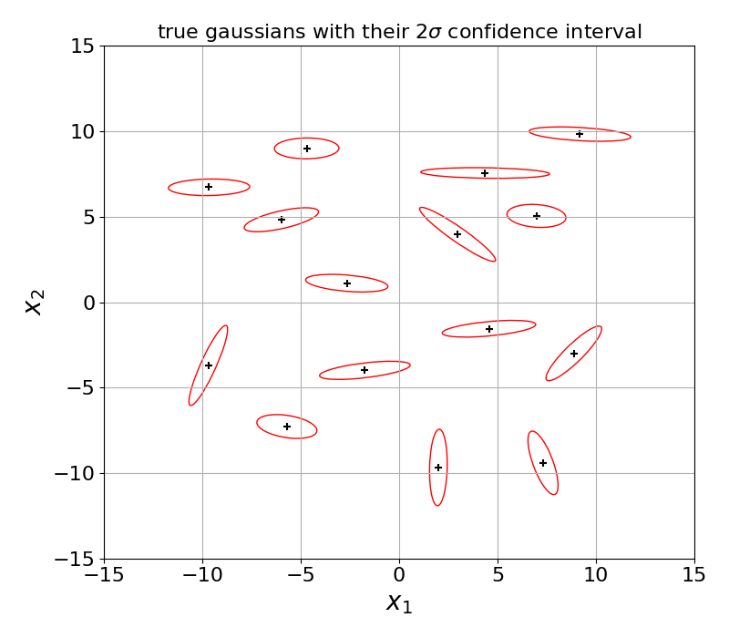

# beetroots

Beetroots (BayEsian invErsion with spaTial Regularization of nOisy multi-line ObservaTion mapS) is a Python package that performs Bayesian inference of physical parameters from multispectral-structured cubes with a dedicated sampling algorithm.
Thanks to this sampling algorithm, `beetroots` provides maps of credibility intervals along with estimated maps.

The sampling algorithm is introduced in

> \[1\] P. Palud, P.-A. Thouvenin, P. Chainais, E. Bron, and F. Le Petit - **Efficient sampling of non log-concave posterior distributions with mixture of noises**, *IEEE Transactions on Signal Processing*, vol. 71, pp. 2491 -- 2501, 2023. DOI: 10.1109/TSP.2023.3289728

Such inversions rely on a forward model that is assumed to emulate accurately the physics of the observed environment.
In parallel of the inversion, `beetroots` tests this hypothesis to evaluate the validity of the inference results.
The testing method is described in (in French)

> \[2\] P. Palud, P. Chainais, F. Le Petit, P.-A. Thouvenin and E. Bron - **Problèmes inverses et test bayésien d'adéquation du modèle**, *GRETSI - Groupe de Recherche en Traitement du Signal et des Images* in *29e Colloque sur le traitement du signal et des images*, Grenoble, pp. 705 -- 708, 2023.

This package was applied e.g., to infer physical conditions in different regions of the interstellar medium in

> \[3\] P. Palud, P.-A. Thouvenin, P. Chainais, E. Bron, F. Le Petit and ORION-B consortium - **Bayesian inversion of large interstellar medium observation maps**, in prep

It was also exploited to assert and compare the relevance of tracers and combination of tracers to constrain physical conditions in

> \[4\] L. Einig, P. Palud, A. Roueff, P.-A. Thouvenin, P. Chainais, E. Bron, F. Le Petit, J. Pety, J. Chanussot and ORION-B consortium -  **Entropy-based selection of most informative observables for inference from interstellar medium observations**, in prep

**Note**: astrophysics applications rely on a neural network-based approximation of the forward model for

- faster evaluations
- ability to evaluate derivatives

The package used to derive this approximation is `nnbma` (Neural Network-Based Model Approximation).
The GitHub repository can be found [here](https://github.com/einigl/ism-model-nn-approximation), the package [here](https://pypi.org/project/nnbma/) and the corresponding documentation [here](https://ism-model-nn-approximation.readthedocs.io/en/latest/?badge=latest).
The paper presenting this package is

> P. Palud, L. Einig, F. Le Petit, E. Bron, P. Chainais, J. Chanussot, J. Pety, P.-A. Thouvenin and ORION-B consortium - **Neural network-based emulation of interstellar medium models**, *Astronomy & Astrophysics*, 2023, 678, pp.A198. DOI: 10.1051/0004-6361/202347074

## Installation and testing

```
git clone git@github.com:pierrePalud/beetroots.git
cd beetroots
poetry install
poetry shell
poetry run pytest
```

## To reproduce the figures in \[1\]

### Gaussian Mixture

Run

```shell
poetry run python beetroots/simulations/other_applications/gaussian_mixture.py gaussian_mix_pmtm0p9.yaml
```

or

```shell
poetry run python beetroots/simulations/other_applications/gaussian_mixture.py gaussian_mix_pmtm0p1.yaml
```

The images will be in `outputs/gaussian_mixture_[yyyy]-[mm]-[dd]_[hh]/img`.
The ESS and MSE values will be in `outputs/gaussian_mixture_[yyyy]-[mm]-[dd]_[hh]/data/output`




### Sensor Localization

Run

```shell
poetry run python beetroots/simulations/other_applications/sensor_loc.py input_params_pmtm0p9.yaml
```

```shell
poetry run python beetroots/simulations/other_applications/sensor_loc.py input_params_pmtm0p1.yaml
```

```shell
poetry run python beetroots/simulations/other_applications/sensor_loc.py input_params_pmtm0p1_false.yaml
```

The images will be in `outputs/sensor_loc_[yyyy]-[mm]-[dd]_[hh]/img`.
The ESS and MSE values will be in `outputs/sensor_loc_[yyyy]-[mm]-[dd]_[hh]/data/output`


______________________________________________________________________

## Astrophysics

### Likelihood approximation parameters optimization

```shell
poetry run python beetroots/approx_optim/nn_bo_toycase.py
poetry run python beetroots/approx_optim/nn_bo_orionbar.py
poetry run python beetroots/approx_optim/nn_bo_ngc7023.py
```

Updated version (TODO: finish)

```shell
poetry run python beetroots/approx_optim/nn_bo_real_data.py ./data/ngc7023/input_nn_bo.yaml
```

### Synthetic data

With nn-based approximation of forward model:

```shell
poetry run python beetroots/simulations/astro/toy_case/toy_case_nn_direct_posterior.py input_params_nn_direct_N10_fixed_angle.yaml
```

```shell
poetry run python beetroots/simulations/astro/toy_case/toy_case_nn_direct_posterior.py input_params_nn_direct_N10_fixed_AV.yaml
```

```shell
poetry run python beetroots/simulations/astro/toy_case/toy_case_nn_direct_posterior.py input_params_nn_direct_N64_fixed_angle.yaml
```

With hierarchical model

```shell
poetry run python beetroots/simulations/astro/toy_case/toy_case_nn_direct_posterior.py input_params_nn_direct_N10_fixed_angle_nomtm.yaml
```

```shell
poetry run python beetroots/simulations/astro/toy_case/toy_case_nn_hierarchical_posterior.py
```

With polynomial approximation of forward model

```shell
poetry run python beetroots/simulations/astro/toy_case/toy_case_polyreg_direct_posterior.py
```

```shell
poetry run python beetroots/simulations/astro/toy_case/toy_case_polyreg_hierarchical_posterior.py
```

### Real data

Orion Bar:

```shell
poetry run python beetroots/simulations/astro/real_data/orionbar_nn_direct_posterior.py input_params.yaml
```

```shell
poetry run python beetroots/simulations/astro/real_data/orionbar_nn_direct_posterior.py input_params_nochp10.yaml
```

NGC 7023:

```shell
poetry run python beetroots/simulations/astro/real_data/ngc7023_nn_direct_posterior.py input_params.yaml
```

Carina nebula:

```shell
poetry run python beetroots/simulations/astro/real_data/carina_nn_direct_posterior.py input_params_1p7_with_spatial_regu.yaml
```

```shell
poetry run python beetroots/simulations/astro/real_data/carina_nn_direct_posterior.py input_params_1p7_with_spatial_regu_optim_mle.yaml
```

OMC1:

```shell
poetry run python beetroots/simulations/astro/real_data/omc1_nn_direct_posterior.py input_params_45per_with_spatial_regu_lines1234_fixed_angle.yaml
```

```shell
poetry run python beetroots/simulations/astro/real_data/omc1_nn_direct_posterior.py input_params_45per_with_spatial_regu_lines1234_fixed_angle_optim_mle.yaml
```

<!-- # poetry run python beetroots/simulations/astro/real_data/omc1_orionbar_nn_direct_posterior.py -->

Horsehead:

```shell
poetry run python beetroots/simulations/astro/real_data/horsehead_nn_direct_posterior.py horsehead_45per_with_spatial_regu_lines_all_co_fixed_angle.yaml
```

## To run a grid of simulations with input files in parallel

First, copy and adapt the `run_multiple_jobs_for_loop.sh` file, then grant it permissions by running

```bash
chmod u+x myscript.sh
```

Finally, run

```bash
./run_multiple_jobs_for_loop.sh
```

______________________________________________________________________

## Reproduce a sampling

During the sampling, the sampler uses a Random Generator object (from numpy) and regularly saves its state together with some indicators of the sampling (values of $Theta$, of objective function, etc.) in a `.hdf5` file. Therefore, to reproduce a sampling from a given point (value of $Theta$ and $V$ and state of the random generator), load these values from `.hdf5` file and then :

- run `sampler.set_rng_state(state_bytes, inc_bytes)` to use correct random generator state
- run the sampler with corresponding values for `x0`and `v0`

## Overall code structure and actions for hierarchical model implementation

The `run_simulations.sh` file is used to run a sampling process.
The sampling process to run and the corresponding main params are defined in `beetroots/__main__.py`.
This `__main__.py` file does 3 things:

1. it instantiates a *Simulation* object
1. it run the *Simulation* `setup` method. This method sets the whole inference problem: importation of observation, definitions of forward map, of likelihood, posterior, etc. and initializes the corresponding output folder.
1. it runs the *Simulation* `main` method, which runs optimization / sampling (depending on the input).

The `simulations` folder contains the most general classes of the repo.
The most important file is `abstract_simulation.py`, which got a bit too big.
A priori: only need to go there to choose which likelihood to use in posterior distribution definitions.

The `sampler` folder contains the definition of the sampler (`mysampler.py`) and of the frequent saves of the MC evolution (`saver.py`).
A priori: should change the `sample` method of the `MySampler` class to incorporate the sampling of the auxiliary variable.

The `modelling` folder contains all the ingredient of the inverse problem.
Its main file is the `posterior.py`.
A priori, the 2 main parts to change in this folder:

- the likelihood (add a lognormal one)
- the posterior file

The `space_transform` folder encodes bijections for switching between parameters natural space (linear) and the parameter space used for sampling (normalized log).
Mainly used at the saving step, to save parameters in their natural space.
No need to change anything there.

**Note**: all classes in `modelling` are implemented in a way tries to avoid duplicated computations. Since I could not cache functions with complicated inputs (dicts, np.ndarray, etc.), I compute everything and store it in dedicated dict.
There are 2 such dictionaries:

- `forward_map_evals`: computed with the `evaluate_all_forward_map` ForwardMap method. It computes the forward map image, gradient, hessian, gradient of the log and/or hessian of the log, depending on the necessity.
- `nll_utils`: computed with the `evaluate_all_nll_utils` likelihood method. The contents depend on the considered likelihood class. This dict is empty for all likelhoods except for the `approx_censored_add_mult.py`. For this class, the nll_utils dict contains all biases $m_a$, $m_m$, variances $s_a$, $s_m$, the mixing weight $\\lambda$ and all their gradients and hessian.

Both of them are made / updated with the `compute_all` method of the `Posterior` class.

## Update documentation

To update the documentation (see `html` folder), run :

```shell
poetry run sphinx-build -b html docs docs/_build/html
```

and to navigate the documentation :

```shell
open docs/_build/html/index.html
```

## Code Structure

This package is large and contains a lot of python modules.
To facilitate code exploration and use, here is an un-rigorous UML class diagram of the code:


## Profiler

```shell
poetry shell

poetry run python -m cProfile -o ./outputs/code_profile.prof beetroots/simu_profiling.py
```
