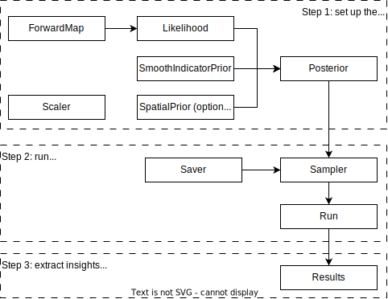

How to set up the input file
============================

With ``beetroots``, to run an inference, run:

.. code-block::

    python <simulation-file>.py <input-file>.yaml

with

* ``<simulation-file>.py``: a python file with a :class:`.Simulation` object, which controls the setup of the inference, runs the inference, and extracts relevant insights from the raw results.
* ``<input-file>.yaml`` : a ``yaml`` file that contains all the parameters of the run, such as whether to run an optimization procedure or a Markov chain, use a spatial regularization or not, etc.

We now detail the two files.

Simulation object
-----------------

As we will show in the following examples, a :class:`.Simulation` object relies on a few other classes.
These classes and their interactions are illustrated in the figure below:

|

Here is a short description of each class.
The first classes are used in the **setup phase**, to set the posterior distribution to be exploited:

* :class:`.ForwardMap` : function :math:`f : \Theta \mapsto Y` that computes observables :math:`Y` from the physical parameters :math:`\Theta` to be inferred. Example: for simple cases, the identity function (implemented in :class:`.BasicForwardMap`)
* :class:`.Likelihood` : data-fidelity function that depends on the noise model. Example: Gaussian likelihood associated to Gaussian noise (implemented in :class:`.GaussianLikelihood`)
* :class:`.SpatialPrior` : spatial regularization prior that favors specific structures in the physical parameter maps :math:`\Theta`
* :class:`.SmoothIndicatorPrior` : prior term implementing a validity interval constraint on the physical parameters :math:`\Theta`
* :class:`.Posterior` : combines all the above classes
* :class:`.Scaler` : The physical parameters are usually defined in a space and sampled in a different one to compensate e.g., for dynamics differences between two parameters. This class defines a bijection between these two spaces. Example: for simple cases, the identity function (implemented in :class:`IdScaler`)

Then, during the **inference phase**, three classes are used to generate a Markov chain or to search for a mode of the posterior distribution:

* :class:`.Sampler` : generates a Markov chain, or runs an optimization procedure, depending on the user input
* :class:`.Saver` : regularly saves the progress of the Markov chain / optimization procedure
* :class:`.Run` : sets up the sampler and saver

Finally, the :class:`.Results` class **extracts insights from the raw results** of the sampling / optimization.

**As a user, the only classes you should worry about are those that define the posterior distribution, i.e., of the first step**.
Many examples of such classes are already implemented.
Therefore, for many interesting cases, few to no classes need to be implemented, as we will see in the following detailed walkthroughs.

YAML file
---------

The input file contains all the parameters that define the run.
These parameters depend on the likelihood, but some parameters are necessary.
Here is an example of input file.
It is actually the file of the first example :ref:`Two-dimensional Gaussian mixture`.

.. code-block:: yaml
    :caption: input-file.yaml
    :name: input-file-yaml

    simu_init:
        simu_name: "gaussian_mix_pmtm0p1" # str: name of the simulation, is used as folder name for the inference outputs
        max_workers: 10 # int: maximum number of processes that can be run in parallel. Useful to, e.g., accelerate results extraction (step 3)

    # how to exploit the posterior distribution
    to_run_optim_map: false # whether to run an optimization procedure
    to_run_mcmc: true # whether to run a sampling.
    # Note: both can be true. Then beetroots will first run the optimization and then the sampling.

    # prior indicator parameters
    prior_indicator:
        indicator_margin_scale: 1.0e-1 # float: quantifies the penalty for values out of the validity intervals. Smaller values mean higher penalties.
        lower_bounds_lin: # List[float]: lower bounds of the physical parameters (here two)
            - -15.0
            - -15.0
        upper_bounds_lin: # List[float]: upper bounds of the physical parameters (here two)
            - +15.0
            - +15.0

    # parameters of the sampler
    sampling_params:
        mcmc: # "mcmc" or "map", to either run an optimization or a MCMC algorithm. An input file can contain both "mcmc" and "map" entries.
            initial_step_size: 0.5 # float: step size for the PMALA / gradient descent
            extreme_grad: 1.0e-5 # float: RMSProp damping parameter
            history_weight: 0.99 # float: RMSProp exponential decay parameter
            selection_probas: [0.1, 0.9] # List[float]: probabilities (p_mtm, p_pmala) of using each kernel at a step t
            k_mtm: 50 # int: number of candidates considered in the MTM-chromatic Gibbs kernel
            is_stochastic: true # bool: true means MCMC, false means optimization
            compute_correction_term: false # bool: whether to compute the correction term. Only used in MCMC. Slows the code for no visible performance gain. Should be put to false.

    # run parameters
    run_params:
        mcmc: # (or "map")
            N_MCMC: 1 # int: number of Markov chains / optimization procedures to run per posterior distribution
            T_MC: 10_000 # int: length of each Markov chain / optimization procedure
            T_BI: 100 # int: Burn-in phase duration
            plot_1D_chains: true # bool: whether to plot each of the 1-dimensional chains
            plot_2D_chains: true # bool: whether to plot pair-plot 2D-histogram
            plot_ESS: true # bool: whether to plot maps of the efective sample size
            freq_save: 1 # int: frequency of saved iterates. Set to 1.
            list_CI: [68, 90, 95, 99] # List[int] : credibility interval sizes

Other entries may be necessary.
For instance, applications to maps / images (involving a spatial regularization) will require a spatial regularization entry.
Here is an example used for astrophysics examples:

.. code-block:: yaml
    :caption: input-file-spatial-prior.yaml
    :name: input-file-spatial-prior-yaml

    with_spatial_prior: true # bool: whether to use a spoatial regularization
    spatial_prior: # if true, then specify the spatial regularization
        name: "L2-laplacian" # str: type of spatial regularization
        use_next_nearest_neighbors: false # bool: whether to use diagonal neighbors or not
        initial_regu_weights: [0.5, 0.5, 0.5, 0.5, 0.5] # List[float]: spatial regularization weight parameters for each physical parameter map (here 5)

Complex forward models may also require extra parameters.
Here is an example used for astrophysics examples, where the physical parameters involved in the forward map are denoted ``kappa``, ``P``, ``radm``, ``Avmax`` and ``angle``:

.. code-block:: yaml
    :caption: input-file-forward-model.yaml
    :name: input-file-forward-model-yaml

    forward_model:
        forward_model_name: "meudon_pdr_model_dense" # str: name of the forward model to load. Models are stored in ``./data/models``
        force_use_cpu: false # bool: whether to force to use CPU or leave the possibility to use GPU (for neural networks only)
        fixed_params: # List[bool]: must contain all the params in list_names of the Simulation object. The parameter set to ``null`` are inferred, the others are set to the indicated value. Values are set in linear scale.
            kappa: null
            P: null
            radm: null
            Avmax: null
            angle: 0.0
        is_log_scale_params: # List[bool]: defines the scale to work with for each param (either log or lin) (used by the Scaler object)
            kappa: True
            P: True
            radm: True
            Avmax: True
            angle: False

Finally, for complex inverse problems, the ``simu_init`` entry can be completed.
Here, the forward map is to take :math:`D=5` physical parameters as input and predict :math:`L = 10` observables which names are informed:

.. code-block:: yaml
    :caption: input-file-complete-simu-init.yaml
    :name: input-file-complete-simu-init-yaml

    simu_init:
        simu_name: astro_toy_N10 # str: see above
        cloud_name: "astro_toy_N10" # str: name of the cloud, must match the observation file name
        max_workers: 10 # int: see above
        #
        params_names: # Dict[str, str]: pairs of names, with first the variable names, and second the name to be displayed in figures
            kappa: $\kappa$
            P: $P_{th}$
            radm: $G_0$
            Avmax: $A_V^{tot}$
            angle: $\alpha$
        #
        list_lines_fit: # List[str]: list of the observables to be used in the inference
            - "co_v0_j4__v0_j3"
            - "co_v0_j5__v0_j4"
            - "co_v0_j6__v0_j5"
            - "co_v0_j7__v0_j6"
            - "co_v0_j8__v0_j7"
            - "co_v0_j9__v0_j8"
            - "co_v0_j10__v0_j9"
            - "co_v0_j11__v0_j10"
            - "co_v0_j12__v0_j11"
            - "co_v0_j13__v0_j12"
