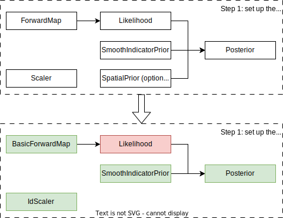

Two-dimensional Gaussian mixture
================================

This example shows how the ``beetroots`` package can be used to sample a simple 2D Gaussian mixture.
This first example appears in Section IV.A of :cite:t:`paludEfficientSamplingNon2023`.
The goal is to sample the following Gaussian mixture model:

.. image:: ../examples/img/gaussian_mixture/true_gaussians.png
   :width: 75%
   :alt: True Gaussian mixture
   :align: center

|

The full distribution is defined by a set of 15 2D mean vectors and 2 by 2 covariance matrices.
These values are indicated in the ``examples/gaussian_mixture/data/gaussian_mixture.csv`` file.

Python Simulation preparation
-----------------------------

Here are the classes that are necessary to sample from this distribution.
The green classes indicate the already implemented classes, and the red classes indicate the classes to implement.

|

Overall, as

* the identity forward map :class:`.BasicForwardMap`
* the :class:`.SmoothIndicatorPrior` class, encoding validity intervals
* the :class:`.Posterior` class

are already implemented in the base ``beetroots`` package, one only needs to implement two classes:

* a dedicated ``Likelihood`` class to encode the Gaussian mixture pdf. Can be found in ``examples/gaussian_mixture/gaussian_mixture_likelihood``
* a dedicated ``Simulation`` class to set up the observation and posterior. Can be found in ``examples/gaussian_mixture/gaussian_mixture_simu``

YAML file
---------

Use the following yaml file:

.. code-block:: yaml
    :caption: input-file.yaml
    :name: input-file-yaml

    simu_init:
        simu_name: "gaussian_mix_pmtm0p1" # str: name of the simulation, is used as folder name for the inference outputs
        max_workers: 10 # int: maximum number of processes that can be run in parallel. Useful to, e.g., accelerate results extraction (step 3)

    # how to exploit the posterior distribution
    to_run_optim_map: false # whether to run an optimization procedure
    to_run_mcmc: true # whether to run a sampling.
    # Note: both can be true. Then beetroots will first run the optimization and then the sampling.

    # prior indicator parameters
    prior_indicator:
        indicator_margin_scale: 1.0e-1 # float: quantifies the penalty for values out of the validity intervals. Smaller values mean higher penalties.
        lower_bounds_lin: # List[float]: lower bounds of the physical parameters (here two)
            - -15.0
            - -15.0
        upper_bounds_lin: # List[float]: upper bounds of the physical parameters (here two)
            - +15.0
            - +15.0

    # parameters of the sampler
    sampling_params:
        mcmc: # "mcmc" or "map", to either run an optimization or a MCMC algorithm. An input file can contain both "mcmc" and "map" entries.
            initial_step_size: 0.5 # float: step size for the PMALA / gradient descent
            extreme_grad: 1.0e-5 # float: RMSProp damping parameter
            history_weight: 0.99 # float: RMSProp exponential decay parameter
            selection_probas: [0.1, 0.9] # List[float]: probabilities (p_mtm, p_pmala) of using each kernel at a step t
            k_mtm: 50 # int: number of candidates considered in the MTM-chromatic Gibbs kernel
            is_stochastic: true # bool: true means MCMC, false means optimization
            compute_correction_term: false # bool: whether to compute the correction term. Only used in MCMC. Slows the code for no visible performance gain. Should be put to false.

    # run parameters
    run_params:
        mcmc: # (or "map")
            N_MCMC: 1 # int: number of Markov chains / optimization procedures to run per posterior distribution
            T_MC: 10_000 # int: length of each Markov chain / optimization procedure
            T_BI: 100 # int: Burn-in phase duration
            plot_1D_chains: true # bool: whether to plot each of the 1-dimensional chains
            plot_2D_chains: true # bool: whether to plot pair-plot 2D-histogram
            plot_ESS: true # bool: whether to plot maps of the efective sample size
            freq_save: 1 # int: frequency of saved iterates. Set to 1.
            list_CI: [68, 90, 95, 99] # List[int] : credibility interval sizes

Sampling
--------

To run the sampling (from ``beetroot``'s root folder):

.. code:: bash

   python examples/gaussian_mixture/gaussian_mixture_simu.py input_params_pmtm0p1.yaml examples/gaussian_mixture/data .

where

* ``examples/gaussian_mixture/gaussian_mixture_simu.py`` is the python file to be run
* ``input_params_pmtm0p9.yaml`` is the yaml file containing the parameters defining the run to be executed
* ``examples/gaussian_mixture/data`` : path to the folder containing the yaml input file and the observation data
* ``.`` : path to the output folder to be created, where the run results are to be saved

To run the sampling from the ``examples/gaussian_mixture`` folder and save outputs there:

.. code:: bash

    cd examples/gaussian_mixture
    python gaussian_mixture_simu.py input_params_pmtm0p9.yaml ./data .

This run will use a selection probability of 90% for the MTM kernel.
To use a 10% selection probability, run

.. code:: bash

    python gaussian_mixture_simu.py input_params_pmtm0p1.yaml ./data .

Output:

>>> python examples/gaussian_mixture/gaussian_mixture_simu.py input_params_pmtm0p1.yaml examples/gaussian_mixture/data .
starting sampling
starting from a random point
100%|█████████████████████████████████████████████████████████| 10000/10000 [00:49<00:00, 200.76it/s]
sampling done
N = 1, L (fit) = 2, D_sampling = 2, D = 2
starting clppd plots
starting plot of accepted frequencies
plots of accepted frequencies done
starting plot of log proba accept
plots of log proba accept done
starting plot of objective function
plot of objective function done
100%|█████████████████████████████████████████████████████████| 1/1 [00:04<00:00,  4.41s/it]
starting Bayesian p-value plots
Bayesian p-value plots plots done
starting plot proportion of well reconstructed pixels
plot proportion of well reconstructed pixels done
Simulation and analysis finished. Total duration : 00:01:04 s

The images will be in ``outputs/gaussian_mixture_[yyyy]-[mm]-[dd]_[hh]/img``.
The ESS and MSE values will be in ``outputs/gaussian_mixture_[yyyy]-[mm]-[dd]_[hh]/data/output``.

Result of the sampling algorithm: 2D histogram

.. image:: ../examples/img/gaussian_mixture/results.png
   :width: 80%
   :alt: Sampling results
   :align: center
