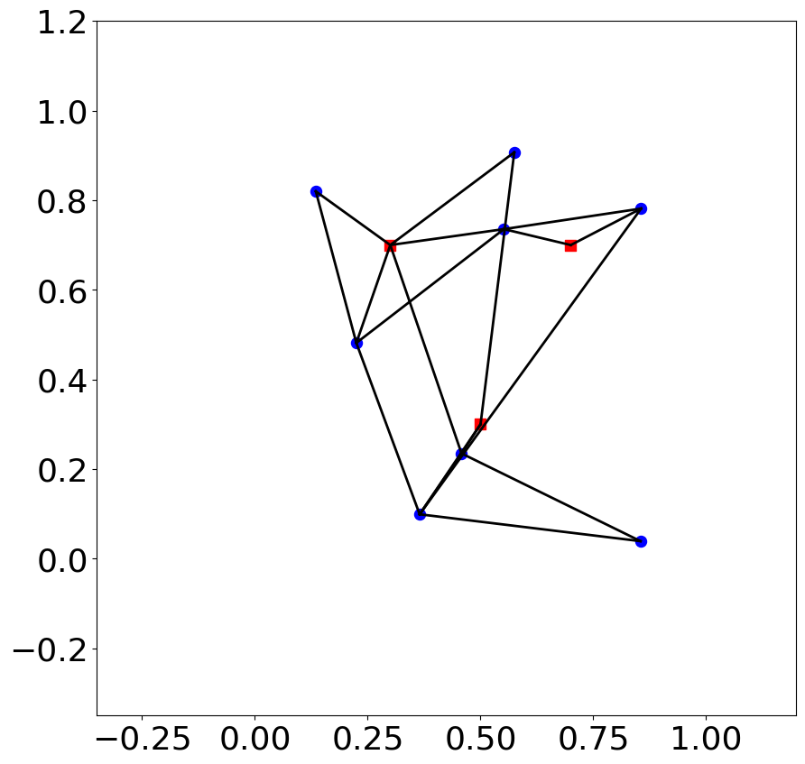
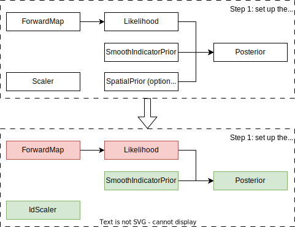
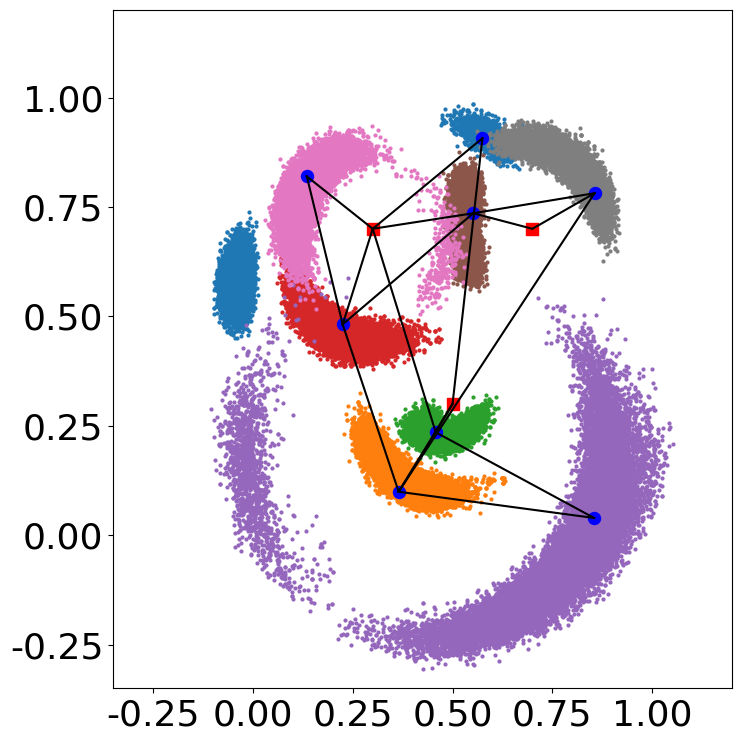
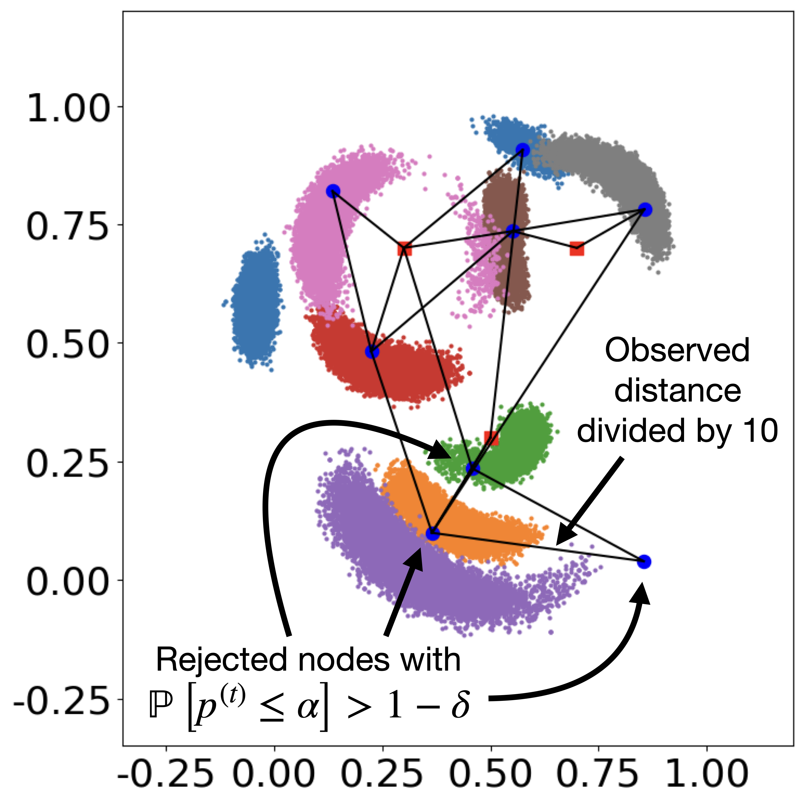

Sensor localization problem
===========================

This example shows how the ``beetroots`` package can be used to perform inversion on a slightly more complicated case: the sensor localization problem, introduced in :cite:t:`ihlerNonparametricBeliefPropagation2005`.
This second example appears in Section IV.B of :cite:t:`paludEfficientSamplingNon2023`.
The goal is to infer the position of sensors from a set of distance between sensors.
The figure below shows the graph of observations with the sensor true positions.

|

The positions and observed distances are is indicated in the ``examples/gaussian_mixture/data/sensor_localization_rescaled.csv`` and ``observation.csv`` files, respectively.

Python Simulation preparation
-----------------------------

Here are the classes that are necessary to sample from this distribution.
The green classes indicate the already implemented classes, and the red classes indicate the classes to implement.

|

Overall, as

* the :class:`.SmoothIndicatorPrior` class, encoding validity intervals
* the :class:`.Posterior` class

are already implemented in the base ``beetroots`` package, one only needs to implement three classes:

* a dedicated ``ForwardMap`` class to compute distances between sensors. Can be found in ``examples/sensor_loc/sensor_loc_forward``.
* a dedicated ``Likelihood`` class to encode the data-fidelity term. Can be found in ``examples/sensor_loc/sensor_loc_likelihood``.
* a dedicated ``Simulation`` class to set up the observation and posterior. ``examples/sensor_loc/sensor_loc_simu``.

YAML file
---------

.. code-block:: yaml
    :caption: input_params_pmtm0p1.py
    :name: input-params-pmtm0p1

    simu_init:
    simu_name: "sensor_loc_pmtm0p1"
    max_workers: 10
    #
    filename_obs: "observation.csv"
    #
    # prior indicator
    prior_indicator:
    indicator_margin_scale: 1.0e-2
    lower_bounds_lin:
        - -0.35
        - -0.35
    upper_bounds_lin:
        - +1.2
        - +1.2
    #
    likelihood:
    R: 0.3
    sigma_a: 0.02
    #
    # sampling params
    sampling_params:
    mcmc:
        initial_step_size:  3.0e-3
        extreme_grad: 1.0e-5
        history_weight: 0.99
        selection_probas: [0.1, 0.9] # (p_mtm, p_pmala)
        k_mtm: 1_000
        is_stochastic: true
        compute_correction_term: false
    #
    # run params
    run_params:
    mcmc:
        N_MCMC: 1
        T_MC: 30_000
        T_BI: 5_000
        plot_1D_chains: true
        plot_2D_chains: true
        plot_ESS: true
        freq_save: 1
        # list_CI: [68, 90, 95, 99]

Sampling
--------

To run the sampling from ``beetroot``'s root folder and save outputs there:

.. code:: bash

    python examples/sensor_loc/sensor_loc_simu.py input_params_pmtm0p9.yaml examples/sensor_loc/data .

where

* ``examples/sensor_loc/sensor_loc_simu.py`` is the python file to be run
* ``input_params_pmtm0p9.yaml`` is the yaml file containing the parameters defining the run to be executed
* ``examples/sensor_loc/data`` : path to the folder containing the yaml input file and the observation data
* ``.`` : path to the output folder to be created, where the run results are to be saved

To run the sampling from the ``examples/sensor_loc`` folder and save outputs there:

.. code:: bash

    cd examples/sensor_loc
    python sensor_loc_simu.py input_params_pmtm0p9.yaml ./data .

This run will use a selection probability of 90% for the MTM kernel.
To use a 10% selection probability, run

.. code:: bash

    python sensor_loc_simu.py input_params_pmtm0p1.yaml ./data .

The images will be in ``outputs/sensor_loc_[yyyy]-[mm]-[dd]_[hh]/img``.
The ESS and MSE values will be in ``outputs/sensor_loc_[yyyy]-[mm]-[dd]_[hh]/data/output``.

Output:

>>> python examples/sensor_loc/sensor_loc_simu.py input_params_pmtm0p9.yaml
starting sampling
starting from a random point
100%|██████████████████████████████████████████████████| 3000/3000 [02:39<00:00, 18.76it/s]
sampling done
N = 8, L (fit) = 11, D_sampling = 2, D = 2
starting clppd plots
starting plot of accepted frequencies
plots of accepted frequencies done
starting plot of log proba accept
plots of log proba accept done
starting plot of objective function
plot of objective function done
100%|███████████████████████████████████████████████████████| 8/8 [00:16<00:00,  2.08s/it]
starting Bayesian p-value plots
Bayesian p-value plots plots done
starting plot proportion of well reconstructed pixels
plot proportion of well reconstructed pixels done
Simulation and analysis finished. Total duration : 00:03:13 s

Sampling results: 2D histograms of the marginal distributions

|

|

See :ref:`Sensor localization: appendix` for more details on the construction of the problem.

Identifying incompatible observations
-------------------------------------

The csv file ``observation_false.csv`` contains a distance that was multiplied by 10 to make the set of observations incompatible.
When running inference and looking at the marginal distribution, this incompatibility does not appear clearly.

|

|

Computing the Bayesian p-value using the method from :cite:t:`paludProblemesInversesTest2023a` permits to identify this incompatibility.

By running

.. code:: bash

    python examples/sensor_loc/sensor_loc_simu.py input_params_pmtm0p9_false.yaml

one can identify the problematic observation.
Indeed, the ``data/output/mcmc/pvalues_analysis.csv`` file identifies the three sensors that are affected by the alteration.
For these three sensors, the reproduced distances are incompatible with the actual observation.

.. csv-table:: p-value analysis
   :file: ../examples/img/sensor_loc/pvalues_analysis.csv
   :widths: 12, 12, 12, 12, 12, 12, 12
   :header-rows: 1

In this column:

* the seed identifies a run (here only one)
* ``n`` identifies the sensor
* ``pval_estim`` provides the Monte Carlo estimator of the p-value
* ``decision_estim_seed`` corresponds to the decision associated to the estimated p-value, i.e., rejection when :math:`p \leq \alpha`, with :math:`\alpha = 0.05` is a confidence level
* ``proba_reject`` is the probability that :math:`p \leq \alpha` when accounting for uncertainties on the p-value due to the Monte Carlo estimation
* ``decision_pval_bayes`` corresponds to the decision associated to the rejection probability.

.. note::

    In this table, for the "decision" columns:

    * "-1" means "reject", in which case an incompatibility is identified
    * "0" means "undecided", in which case the uncertainty on the p-value is too high to take a decision with high confidence
    * "1" means "no reject"
